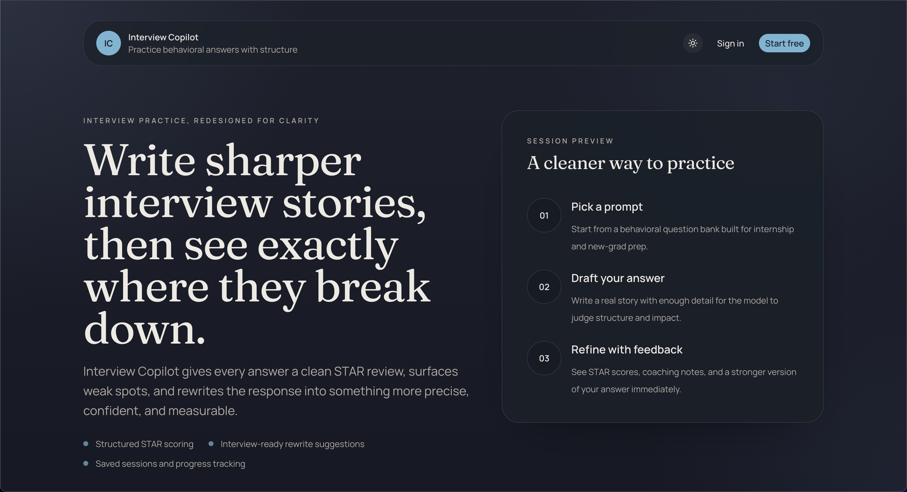
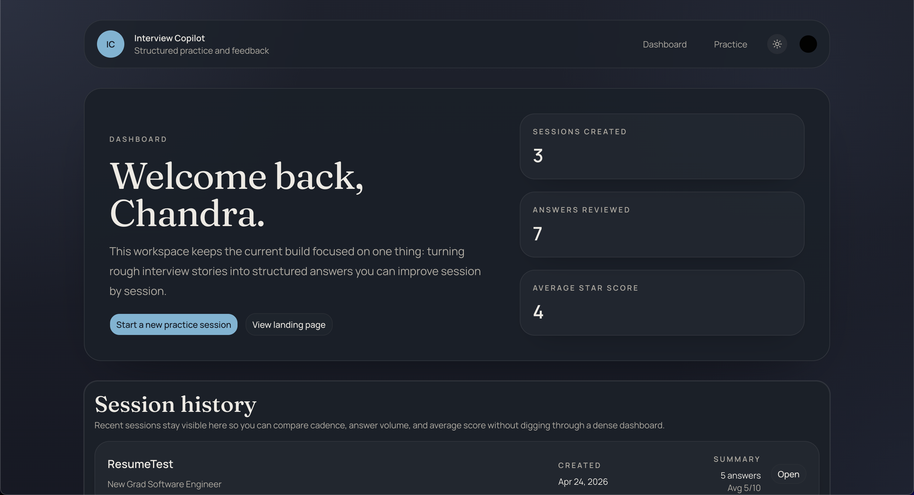
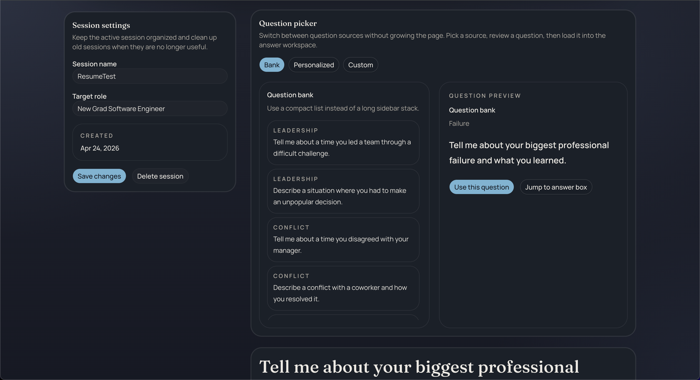
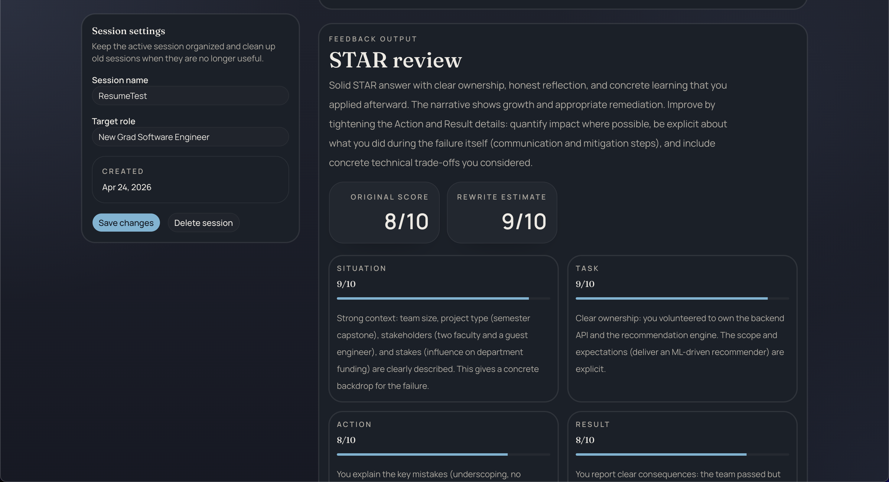

# Interview Copilot

Interview Copilot is a session-based interview practice app for behavioral questions. It helps a user create a practice session, answer questions in a structured workspace, and receive AI-generated STAR feedback with actionable coaching, score breakdowns, and saved history.

The current build is focused on making interview practice feel persistent instead of disposable. A user can start a session for a specific role, continue that session later, review previous answers, and compare feedback over time.

## What It Does

- creates named interview practice sessions tied to a target role
- lets users resume old sessions instead of starting over
- generates STAR-based AI feedback for each answer
- rewrites each answer and re-scores it with the same rubric
- stores answer history, score history, and feedback history in Supabase
- generates personalized questions from a saved experience profile
- supports custom pasted questions and AI follow-up questions
- supports light and dark mode
- uses Clerk for authentication so each user sees only their own sessions

## Core Workflow

1. Sign in
2. Create a new practice session or reopen an existing one
3. Pick a behavioral interview prompt
4. Write an answer
5. Get AI feedback with:
   - Situation / Task / Action / Result scores
   - original overall score
   - rewritten-answer estimated score
   - strengths
   - weaknesses
   - improved answer rewrite
   - keyword coverage
6. Generate a follow-up question or continue with another prompt in the same session
7. Revisit the session later and continue improving answers in the same thread of work

## Why This Project Exists

Most interview prep tools either:

- throw random questions at the user with no continuity
- give generic AI feedback without context
- make it hard to revisit earlier work

Interview Copilot is trying to solve that by treating a practice session as the main object. Instead of isolated AI ratings, the app keeps questions, answers, and coaching together so the user can iterate on real stories over time.

## Features

- authentication with Clerk
- session hub for creating and reopening sessions
- dedicated session pages with answer history
- AI feedback generation with OpenAI
- STAR scoring breakdown across Situation, Task, Action, and Result
- answer rewrite plus second-pass rubric re-evaluation
- experience profile storage for personalization
- AI-generated personalized questions
- custom question input
- follow-up interviewer mode
- session rename and delete
- in-app delete confirmation modal
- dark mode / light mode toggle

## Tech Stack

- Next.js 16
- React 19
- TypeScript
- Tailwind CSS 4
- Clerk
- Supabase
- OpenAI API
- Zod
- Base UI / shadcn-style component patterns

## Project Structure

```text
app/
  (auth)/                 Clerk sign-in and sign-up routes
  (dashboard)/            Authenticated dashboard and practice routes
  api/                    Session and feedback API routes
components/               Reusable UI and workflow components
lib/                      Validation, OpenAI, Supabase, types, helpers
supabase/schema.sql       Database schema
```

## Screenshots

### Landing Page



### Dashboard



### Practice Workspace



### Feedback Flow



## Local Development

### 1. Install dependencies

```bash
npm install
```

### 2. Create environment variables

Copy the example file:

```bash
cp .env.local.example .env.local
```

Then fill in the real values for:

- `OPENAI_API_KEY`
- `OPENAI_MODEL`
- `NEXT_PUBLIC_CLERK_PUBLISHABLE_KEY`
- `CLERK_SECRET_KEY`
- `NEXT_PUBLIC_CLERK_SIGN_IN_URL`
- `NEXT_PUBLIC_CLERK_SIGN_UP_URL`
- `NEXT_PUBLIC_CLERK_AFTER_SIGN_IN_URL`
- `NEXT_PUBLIC_CLERK_AFTER_SIGN_UP_URL`
- `NEXT_PUBLIC_SUPABASE_URL`
- `NEXT_PUBLIC_SUPABASE_ANON_KEY`
- `SUPABASE_SERVICE_ROLE_KEY`

### 3. Apply the Supabase schema

Run the SQL in:

- `supabase/schema.sql`

This creates:

- `sessions`
- `answers`
- `feedback`
- `experience_profiles`

### 4. Start the dev server

```bash
npm run dev
```

Then open:

- [http://localhost:3000](http://localhost:3000)

## Required Environment Variables

```env
OPENAI_API_KEY=your_openai_api_key
OPENAI_MODEL=gpt-5-mini

NEXT_PUBLIC_CLERK_PUBLISHABLE_KEY=your_clerk_publishable_key
CLERK_SECRET_KEY=your_clerk_secret_key
NEXT_PUBLIC_CLERK_SIGN_IN_URL=/sign-in
NEXT_PUBLIC_CLERK_SIGN_UP_URL=/sign-up
NEXT_PUBLIC_CLERK_AFTER_SIGN_IN_URL=/dashboard
NEXT_PUBLIC_CLERK_AFTER_SIGN_UP_URL=/dashboard

NEXT_PUBLIC_SUPABASE_URL=https://your-project-ref.supabase.co
NEXT_PUBLIC_SUPABASE_ANON_KEY=your_supabase_anon_key
SUPABASE_SERVICE_ROLE_KEY=your_supabase_service_role_key
```

Important:

- `NEXT_PUBLIC_SUPABASE_URL` must be the project base URL, not `/rest/v1`
- `SUPABASE_SERVICE_ROLE_KEY` is server-only
- Clerk development keys are fine locally, but production needs production keys

## API Overview

### `POST /api/sessions`

Creates a new practice session for the authenticated user.

### `GET /api/sessions`

Returns the current user's session summaries.

### `PATCH /api/sessions/[sessionId]`

Updates the title or target role for an existing session owned by the current user.

### `DELETE /api/sessions/[sessionId]`

Deletes a session and its related answers and feedback.

### `POST /api/feedback`

Creates an answer inside a session and generates AI feedback for it.

### `GET /api/profile`

Returns the signed-in user's saved experience profile.

### `POST /api/profile`

Creates or updates the user's experience profile for personalized coaching.

### `POST /api/questions/personalized`

Generates fresh interview questions from the saved experience profile and session role.

### `POST /api/questions/follow-up`

Generates follow-up interviewer questions based on the user's answer.

## Database Model

### `sessions`

- one row per interview practice session
- stores title, target role, and owning Clerk user id

### `answers`

- one row per submitted answer
- tied to a session
- stores question text, category, and answer text

### `feedback`

- one row per AI coaching result
- tied to an answer
- stores original STAR scores, rewritten-answer STAR scores, summary, strengths, weaknesses, improved answer, and keyword analysis

### `experience_profiles`

- one row per user
- stores reusable background context for personalization
- includes target role and pasted experience text

## Current Limitations

- the question bank is still relatively small even though personalized generation reduces repetition
- follow-up mode is text-based only, not a full conversational mock interview
- there is no export/share flow yet
- there is no analytics dashboard for long-term progress trends yet
- resume intake currently uses pasted experience text, not file upload parsing

## Good Next Features

If there is another week to improve the project, the highest-value additions are probably:

1. Dynamic question generation
   - generate role-specific and company-specific behavioral questions instead of repeating a fixed bank
2. Progress analytics
   - show how STAR scores change over time across sessions and categories
3. Story library
   - let users save core stories once, then reuse and adapt them across many prompts
4. Weakness targeting
   - identify recurring issues such as vague actions, weak metrics, or missing results and recommend drills
5. Mock interview mode
   - run a timed multi-question practice session instead of one answer at a time
6. Question source expansion
   - add curated banks for internships, new grad, PM, data, and consulting roles

## Submission Notes

This repo is currently positioned as a strong challenge submission because it already demonstrates:

- real auth
- real persistence
- real AI evaluation
- reusable session workflows
- thoughtful product iteration beyond a one-shot demo

The biggest improvement still available is making the coaching feel more personalized and less dependent on a fixed prompt list.
